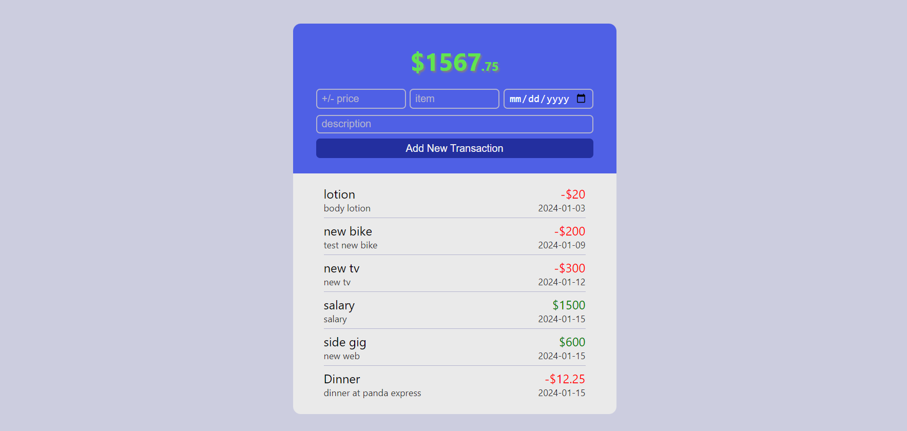

# MERN Money Tracker Web App

## Overview

This money tracker is a MERN (MongoDB, Express.js, React, Node.js) stack web application that helps users track their financial transactions. It provides a user-friendly interface for adding, viewing, and managing financial transactions.


## Features

- **Add Transactions:** Users can add new financial transactions by specifying the price, name, description, and date.

- **View Transactions:** The application displays a list of transactions, including details such as name, description, price, and date. Negative prices are displayed in red, and positive prices are displayed in green for easy identification.

- **Balance Display:** The balance is prominently displayed at the top, indicating the current financial status.

## Technologies Used

- **MongoDB:** Database for storing transaction data.

- **Express.js:** Backend framework for handling server-side logic and API requests.

- **React:** Frontend library for building a dynamic and interactive user interface.

- **Node.js:** Runtime environment for running the server-side code.

## Getting Started

### Prerequisites

- Node.js and npm installed
- MongoDB installed and running

### Installation

```bash
git clone https://github.com/your-username/mern-money-tracker.git
cd mern-money-tracker
npm install
```

### Set up environment variables

Create a .env file in the root directory and add the following:

```bash
"REACT_APP_API_URL=http://localhost:4000/api" >> .env
"MONGO_URL=your_mongo_db_connection_string" >> .env
```

### Run the application

```bash
npm start
```

The application will be accessible at http://localhost:3000.

## Usage

- Open the application in your web browser.
- Add new transactions by filling out the form at the top of the page.
- View and manage existing transactions in the list below.
- The balance is displayed prominently at the top.
